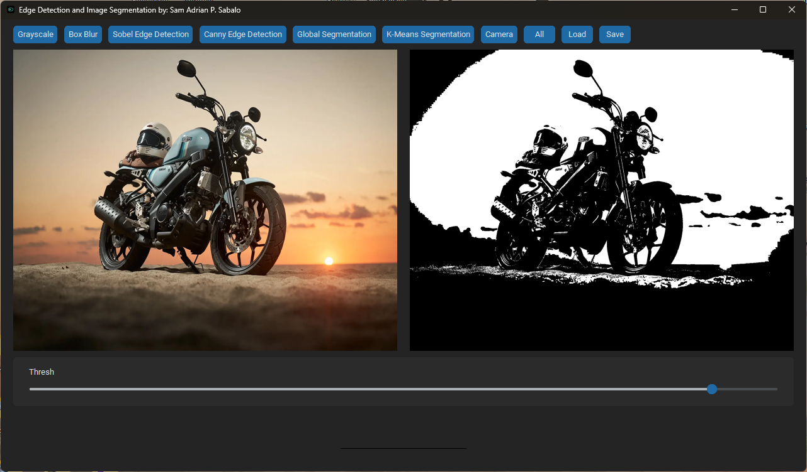
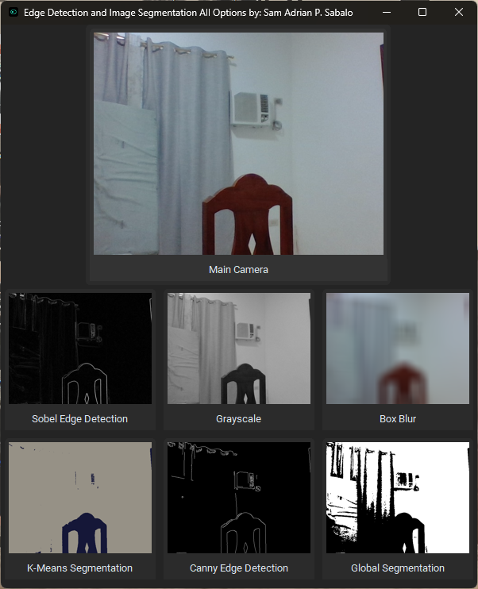

# GUI Edge Detection and Image Segmentation

## 🧠 Project Overview

This project was developed as part of our **3rd Year Software Engineering course**, designed to introduce us to **Python GUI programming** and **image processing techniques**. The app provides an interactive interface where users can apply multiple edge detection filters and segmentation methods to an image and adjust their thresholds dynamically.

The primary goal was to combine UI development with real-time computer vision using `customtkinter` and `OpenCV`.

---

## ✨ Features

* 🖼️ **Multiple Edge Detection Filters**:

  * Canny
  * Sobel (X and Y)
  * Laplacian
  * Prewitt

* 🎚️ **Interactive Threshold Sliders**:

  * Modify upper and lower thresholds for applicable filters in real-time.

* 🔄 **Instant Feedback**:

  * View updated output immediately after adjusting any setting.

* 🧩 **CustomTkinter Interface**:

  * Clean, modern, and responsive GUI layout with theme support.

* 🗂️ **Supports Multiple Filters**:

  * View and compare all filters simultaneously.

---

## 🛠️ Technologies Used

* **Python 3.x**
* **OpenCV** – for all computer vision and edge detection algorithms.
* **CustomTkinter** – for the sleek GUI.
* **NumPy** – for array operations and image handling.
* **Pillow (PIL)** – for loading and converting image formats.

---

## 📦 Installation

### 🔧 Prerequisites

* Python 3.8 or higher
* (Optional) Create and activate a virtual environment:

  ```bash
  python -m venv venv
  source venv/bin/activate  # On Windows: venv\Scripts\activate
  ```

### 📥 Steps

1. Clone the repository:

   ```bash
   git clone https://github.com/your-username/GUI-Edge-Detection-and-Image-Segmentation.git
   cd GUI-Edge-Detection-and-Image-Segmentation
   ```

2. Install the required dependencies:

   ```bash
   pip install -r requirements.txt
   ```

---

## ▶️ Running the App

Run the program using:

```bash
python Program.py
```

The GUI will launch, and you can begin experimenting with different edge detection filters and their thresholds.

---

## 📸 Screenshots

| GUI Interface | All Filters View        |
| ------------- | ----------------------- |
|  |  |

---

## 📈 Learning Outcomes

Through this project, we learned how to:

* Build modern Python GUIs with **CustomTkinter**.
* Use **OpenCV** for real-time image processing.
* Apply and differentiate between multiple edge detection algorithms.
* Handle GUI-to-logic interaction in a clean and maintainable way.
* Work with sliders and real-time updates for computer vision tasks.

---

## 🔮 Future Improvements

* Add support for **live webcam input**.
* Implement **segmentation techniques** like watershed or k-means.
* Allow **image saving and export** of processed results.
* Provide **preset options** for popular configurations.
* Include basic **histogram visualizations** for pixel distributions.

---

## 🙏 Acknowledgements

* [OpenCV](https://opencv.org/) – for the core image processing functionalities.
* [CustomTkinter](https://github.com/TomSchimansky/CustomTkinter) – for the beautifully styled modern GUI framework.
* Big thanks to our instructors and peers for guidance and feedback.

---

## 📄 License

This project is licensed under the **GNU General Public License v3.0** – see the [LICENSE](LICENSE) file for details.

> The GPL-3.0 license permits free use, modification, and redistribution, with the requirement that derivative works remain open-source under the same license.

